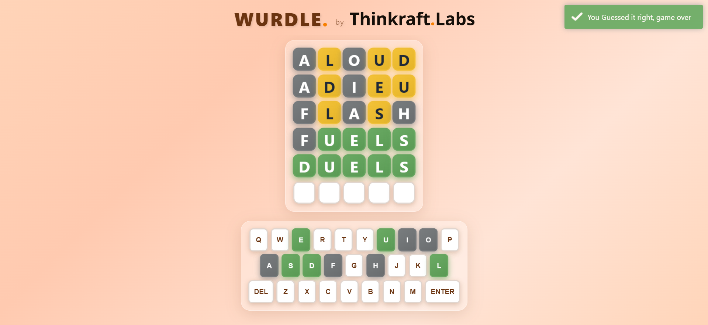

  
  
  # WURDLE.
  
  ### by Thinkraft
  
  *A Modern Take on the Classic Word Guessing Game*
  
  

## 🎮 About the Game

**WURDLE** is a beautifully designed word-guessing game that challenges players to guess a five-letter word within six attempts. Each guess provides visual feedback through color-coded tiles, helping you discover the hidden word.

### Game Features

- **6 Attempts** - You have six chances to guess the correct five-letter word
- **Color-Coded Feedback**
  - 🟢 **Green** - Letter is correct and in the right position
  - 🟡 **Yellow** - Letter is in the word but in the wrong position
  - ⚫ **Grey** - Letter is not in the word
- **Interactive Keyboard** - On-screen keyboard with visual feedback
- **Responsive Design** - Optimized for both desktop and mobile devices
- **Smooth Animations** - Modern UI with playful interactions

## 🎯 How to Play

1. **Start Typing** - Enter a five-letter word using your keyboard or the on-screen buttons
2. **Submit Your Guess** - Press Enter to check your word
3. **Read the Feedback** - Observe the color changes to guide your next guess
4. **Win or Learn** - Keep guessing until you find the word or run out of attempts

### Tips for Success

- Start with words containing common vowels (A, E, I, O, U)
- Use your first guesses to eliminate or confirm letters
- Pay attention to letter positions indicated by yellow tiles
- Think strategically about letter placement

## ⚡ Performance

WURDLE is optimized for speed and responsiveness:

- Hardware-accelerated animations
- Minimal CSS transitions for snappy interactions
- Efficient rendering with GPU optimization
- Fast load times with optimized assets

## 📱 Mobile Experience

The mobile version offers:

- **Full-Width Keyboard** - Optimized button sizing for touch screens
- **Larger Game Board** - Enhanced visibility on smaller screens
- **Streamlined Interface** - Logo and branding hidden for maximum game space
- **Natural Layout** - Keyboard positioned close to game board for easy reach

## 🛠️ Built With

- **HTML5** - Semantic markup
- **CSS3** - Modern styling with animations and glassmorphism
- **Vanilla JavaScript** - Pure JS for game logic and interactions
- **Toastr.js** - Elegant notifications
- **Animate.css** - Smooth animations

## 🎓 Credits

**Developed by Thinkraft Labs**

The Original Wordle game is a Property of The New York Times

A passion project combining elegant design with engaging gameplay.

---

  
  ### Play Now & Challenge Yourself!
  
  *Can you guess the word in 6 tries?*
  

  
  Made with ❤️ by Thinkraft Labs
  

